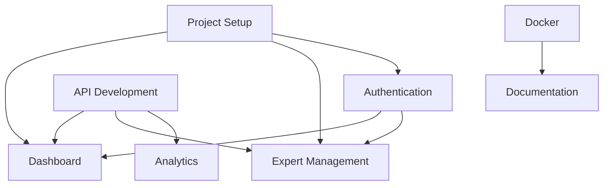

# Expert Registry Admin UI - Jira Issues Summary

**Last Updated: 2025-07-01**

## Implementation Status

### Completed (Sprint 1-2)
- ✅ **ER-7**: React Project Setup (5 points)
  - ✅ **ER-12**: Initialize Vite project with React and TypeScript
  - ✅ **ER-13**: Install and configure Mantine UI dependencies
  - ✅ **ER-14**: Set up ESLint and Prettier configuration
  - ✅ **ER-15**: Create initial project folder structure

- ✅ **ER-9**: REST API Endpoints (Partial - 8/13 points)
  - ✅ **ER-26**: Create FastAPI admin router
  - ✅ **ER-27**: Implement expert CRUD endpoints
  - ✅ **ER-28**: Create statistics endpoints
  - ✅ **ER-29**: Implement SSE for real-time
  - ⏳ **ER-30**: Add authentication middleware (pending)

- ✅ **ER-10**: Docker Integration (5 points)
  - ✅ Multi-stage Dockerfile created
  - ✅ Docker Compose configuration
  - ✅ Build scripts

### In Progress (Sprint 3)
- 🚧 **ER-2**: Dashboard (6/8 points)
  - ✅ **ER-16**: Create StatsCard component
  - ✅ **ER-17**: Implement usage timeline chart
  - ✅ **ER-18**: Create dashboard layout with Grid
  - ⏳ **ER-19**: Connect to overview stats API (mock data)
  - ⏳ **ER-20**: Implement real-time updates with SSE (partial)

- 🚧 **ER-3**: Expert Management (8/13 points)
  - ✅ **ER-21**: Build ExpertTable component
  - ✅ **ER-22**: Create ExpertForm component
  - ✅ **ER-23**: Implement expert CRUD API hooks
  - ✅ **ER-24**: Create expert management page
  - ⏳ **ER-25**: Add export/import functionality (pending)

- 🚧 **ER-4**: Context Editor (4/8 points)
  - ✅ Monaco Editor integration
  - ✅ Basic UI structure
  - ⏳ Live preview (pending)
  - ⏳ Version history (pending)

- 🚧 **ER-5**: Analytics (6/13 points)
  - ✅ Usage timeline charts
  - ✅ Expert distribution charts
  - ✅ Task type analysis
  - ⏳ CSV export (pending)

- 🚧 **ER-6**: Performance Monitoring (5/8 points)
  - ✅ Performance tables
  - ✅ Basic metrics display
  - ⏳ Comparison views (partial)
  - ⏳ Trend analysis (basic)

## Epic Overview

**ER-1: Admin Interface for Expert Registry MCP**
- Comprehensive administrative interface using React and Mantine
- Provides CRUD operations, analytics, and real-time monitoring
- Docker-integrated deployment

## User Stories & Tasks Breakdown

### 1. Project Setup & Infrastructure

#### ER-7: React Project Setup (5 points)
Setup React project with Mantine UI framework
- **ER-12**: Initialize Vite project with React and TypeScript (2 points)
- **ER-13**: Install and configure Mantine UI dependencies (2 points)
- **ER-14**: Set up ESLint and Prettier configuration (1 point)
- **ER-15**: Create initial project folder structure (1 point)

#### ER-10: Docker Integration (5 points)
Integrate admin UI with Docker deployment
- Multi-stage Dockerfile
- Static file serving
- Environment configuration

### 2. Core Features

#### ER-2: Dashboard (8 points)
System overview statistics dashboard
- **ER-16**: Create StatsCard component (2 points)
- **ER-17**: Implement usage timeline chart (3 points)
- **ER-18**: Create dashboard layout with Grid (2 points)
- **ER-19**: Connect to overview stats API (2 points)
- **ER-20**: Implement real-time updates with SSE (3 points)

#### ER-3: Expert Management (13 points)
Full CRUD operations for experts
- **ER-21**: Build ExpertTable component (3 points)
- **ER-22**: Create ExpertForm component (3 points)
- **ER-23**: Implement expert CRUD API hooks (2 points)
- **ER-24**: Create expert management page (2 points)
- **ER-25**: Add export/import functionality (3 points)

#### ER-4: Context Editor (8 points)
Edit expert context files with syntax highlighting
- Monaco Editor integration
- Live preview
- Version history

#### ER-5: Analytics (13 points)
Detailed usage analytics and trends
- Usage timeline charts
- Expert distribution
- Task type analysis
- CSV export

#### ER-6: Performance Monitoring (8 points)
Expert performance metrics tracking
- Performance tables
- Comparison views
- Trend analysis

### 3. Backend Development

#### ER-9: REST API Endpoints (13 points)
FastAPI endpoints for admin operations
- **ER-26**: Create FastAPI admin router (2 points)
- **ER-27**: Implement expert CRUD endpoints (3 points)
- **ER-28**: Create statistics endpoints (3 points)
- **ER-29**: Implement SSE for real-time (3 points)
- **ER-30**: Add authentication middleware (2 points)

### 4. Security & Authentication

#### ER-8: Authentication System (8 points)
JWT-based authentication with RBAC
- Login/logout functionality
- Role-based access control
- Protected routes

### 5. Additional Features

#### ER-11: Discovery Testing Interface (8 points)
Test expert discovery functionality
- Interactive query builder
- Performance benchmarking
- Results visualization

#### ER-31: System Logs Viewer (5 points)
Real-time log monitoring
- Log streaming
- Error tracking
- Export capabilities

#### ER-32: Settings Page (5 points)
System configuration management
- Performance tuning
- Cache settings
- Backup/restore

### 6. Quality & Documentation

#### ER-33: Testing Infrastructure (8 points)
Comprehensive testing coverage
- Unit tests
- Integration tests
- E2E tests
- CI/CD integration

#### ER-34: Documentation (5 points)
Complete project documentation
- API documentation
- Component storybook
- User guides
- Developer guides

## Story Points Summary

- **Total Epic Points**: 120
- **Frontend Development**: 70 points
- **Backend Development**: 25 points
- **Infrastructure & DevOps**: 10 points
- **Testing & Documentation**: 15 points

## Priority Recommendations

### Phase 1: Foundation (Sprint 1-2)
1. ER-7: Project Setup
2. ER-9: API Development
3. ER-10: Docker Integration
4. ER-8: Authentication

### Phase 2: Core Features (Sprint 3-5)
1. ER-2: Dashboard
2. ER-3: Expert Management
3. ER-4: Context Editor

### Phase 3: Analytics & Advanced (Sprint 6-7)
1. ER-5: Analytics
2. ER-6: Performance Monitoring
3. ER-11: Discovery Testing

### Phase 4: Polish & Deploy (Sprint 8)
1. ER-31: System Logs
2. ER-32: Settings
3. ER-33: Testing
4. ER-34: Documentation

## Technical Dependencies

## Success Metrics

1. **Development Velocity**: Complete 15-20 story points per sprint
2. **Test Coverage**: Maintain >80% code coverage
3. **Performance**: Dashboard loads in <2 seconds
4. **User Experience**: Admin tasks completed 50% faster than manual methods
5. **Reliability**: 99.9% uptime for admin interface

## Risk Mitigation

1. **Technical Debt**: Allocate 20% of sprint capacity for refactoring
2. **Security**: Conduct security review before production deployment
3. **Performance**: Load test with 10x expected traffic
4. **Documentation**: Update docs with each feature completion

This comprehensive breakdown provides a clear roadmap for implementing the Expert Registry Admin Interface with well-defined stories, tasks, and priorities.