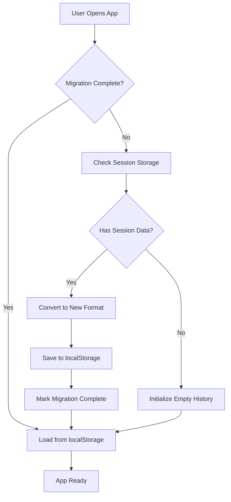

# Query History Migration Plan

**Last Updated: 2025-01-07**

## Overview

This document outlines the migration strategy for transitioning the Expert Discovery query history from session-only storage to persistent browser storage, with a future path to user-authenticated cloud storage (ER-8).

## Migration Phases Overview

```
Phase 1: Browser Storage (Immediate)
├── localStorage implementation
├── Session data migration
└── Backward compatibility

Phase 2: Enhanced Storage (Week 2-3)
├── IndexedDB integration
├── Advanced features
└── Performance optimization

Phase 3: User Data Storage (Future - ER-8)
├── Server-side storage
├── User authentication
├── Cross-device sync
└── Privacy controls
```

## Phase 1: Browser Storage Implementation

### Objectives
- Implement persistent query history using localStorage
- Migrate existing session data without data loss
- Maintain backward compatibility
- Enable feature toggling

### Timeline: 5-7 Days

#### Day 1-2: Core Implementation
```typescript
// 1. Storage Service Implementation
class QueryHistoryStorage {
  // Implement core CRUD operations
  static async save(entry: QueryHistoryEntry): Promise<void>
  static async load(): Promise<QueryHistoryEntry[]>
  static async migrate(sessionData: string[]): Promise<void>
}

// 2. Migration Handler
class QueryHistoryMigration {
  static async migrateFromSession(): Promise<void> {
    // Check for existing session data
    const sessionHistory = this.getSessionHistory()
    if (!sessionHistory || sessionHistory.length === 0) return
    
    // Convert to new format
    const entries = sessionHistory.map(query => ({
      id: crypto.randomUUID(),
      query,
      timestamp: Date.now(),
      parameters: this.inferParameters(),
      algorithm: 'vector' as const,
      success: true
    }))
    
    // Save to localStorage
    await QueryHistoryStorage.saveAll(entries)
    
    // Mark migration complete
    localStorage.setItem('query-history-migrated', 'true')
  }
}
```

#### Day 3-4: Component Integration
```typescript
// Update QueryInput component
export function QueryInput({ ...props }) {
  // Check for migration on first render
  useEffect(() => {
    const migrated = localStorage.getItem('query-history-migrated')
    if (!migrated) {
      QueryHistoryMigration.migrateFromSession()
        .then(() => console.log('Query history migrated successfully'))
        .catch(err => console.error('Migration failed:', err))
    }
  }, [])
  
  // Use new persistent storage
  const { entries, addEntry } = useQueryHistory()
}
```

#### Day 5-7: Testing & Rollout
- Unit tests for migration logic
- Integration tests for component updates
- Feature flag implementation
- Gradual rollout plan

### Migration Logic Flow



### Data Format Migration

#### Old Format (Session Storage)
```typescript
// Simple string array
const sessionHistory: string[] = [
  "Python expert needed",
  "React developer with TypeScript",
  "DevOps specialist AWS"
]
```

#### New Format (localStorage)
```typescript
interface QueryHistoryEntry {
  id: string
  query: string
  parameters: {
    algorithm: SearchAlgorithm
    maxResults: number
    technologies?: string[]
    experienceLevel?: string
  }
  timestamp: number
  resultCount?: number
  searchTime?: number
  success: boolean
}
```

### Backward Compatibility

1. **Feature Detection**
   ```typescript
   const supportsLocalStorage = () => {
     try {
       const test = '__storage_test__'
       localStorage.setItem(test, test)
       localStorage.removeItem(test)
       return true
     } catch (e) {
       return false
     }
   }
   ```

2. **Fallback Strategy**
   ```typescript
   class StorageAdapter {
     static async save(key: string, data: any): Promise<void> {
       if (supportsLocalStorage()) {
         localStorage.setItem(key, JSON.stringify(data))
       } else {
         // Fallback to sessionStorage or in-memory
         sessionStorage.setItem(key, JSON.stringify(data))
       }
     }
   }
   ```

3. **Progressive Enhancement**
   ```typescript
   const STORAGE_FEATURES = {
     BASIC: ['save', 'load', 'remove'],
     ENHANCED: ['search', 'export', 'import'],
     ADVANCED: ['sync', 'analytics', 'suggestions']
   }
   ```

## Phase 2: Enhanced Storage Features

### Objectives
- Add IndexedDB for advanced features
- Implement search and filtering
- Add export/import functionality
- Optimize performance

### Timeline: Week 2-3

#### Storage Architecture
```typescript
// Hybrid storage approach
class HybridQueryStorage {
  private static readonly RECENT_KEY = 'query-history-recent'
  private static readonly DB_NAME = 'expert-discovery-db'
  
  // Recent queries in localStorage (fast access)
  static async getRecent(limit = 10): Promise<QueryHistoryEntry[]> {
    const stored = localStorage.getItem(this.RECENT_KEY)
    return stored ? JSON.parse(stored).slice(0, limit) : []
  }
  
  // Full history in IndexedDB (unlimited storage)
  static async getAll(): Promise<QueryHistoryEntry[]> {
    const db = await this.openDB()
    return db.transaction('queries').objectStore('queries').getAll()
  }
  
  // Smart caching strategy
  static async save(entry: QueryHistoryEntry): Promise<void> {
    // Save to both storages
    await this.saveToLocalStorage(entry)
    await this.saveToIndexedDB(entry)
  }
}
```

#### Advanced Features Implementation

1. **Search Functionality**
   ```typescript
   async searchHistory(term: string): Promise<QueryHistoryEntry[]> {
     const db = await this.openDB()
     const index = db.transaction('queries')
       .objectStore('queries')
       .index('query')
     
     return index.getAll(IDBKeyRange.bound(term, term + '\uffff'))
   }
   ```

2. **Export/Import**
   ```typescript
   async exportHistory(): Promise<string> {
     const entries = await this.getAll()
     return JSON.stringify({
       version: '1.0',
       exportDate: new Date().toISOString(),
       entries
     }, null, 2)
   }
   
   async importHistory(jsonData: string): Promise<void> {
     const { entries } = JSON.parse(jsonData)
     // Validate and merge with existing
     await this.mergeEntries(entries)
   }
   ```

3. **Analytics Integration**
   ```typescript
   async getAnalytics(): Promise<QueryAnalytics> {
     const entries = await this.getAll()
     return {
       totalQueries: entries.length,
       successRate: entries.filter(e => e.success).length / entries.length,
       popularAlgorithms: this.groupByAlgorithm(entries),
       queryFrequency: this.calculateFrequency(entries)
     }
   }
   ```

### Performance Optimization

1. **Lazy Loading**
   ```typescript
   const useQueryHistoryLazy = () => {
     const [entries, setEntries] = useState<QueryHistoryEntry[]>([])
     const [loading, setLoading] = useState(true)
     
     useEffect(() => {
       // Load recent entries first
       HybridQueryStorage.getRecent().then(setEntries)
       
       // Load full history in background
       HybridQueryStorage.getAll().then(all => {
         setEntries(all)
         setLoading(false)
       })
     }, [])
     
     return { entries, loading }
   }
   ```

2. **Batch Operations**
   ```typescript
   class BatchProcessor {
     private queue: QueryHistoryEntry[] = []
     private timer: NodeJS.Timeout | null = null
     
     add(entry: QueryHistoryEntry) {
       this.queue.push(entry)
       this.scheduleFlush()
     }
     
     private scheduleFlush() {
       if (this.timer) return
       this.timer = setTimeout(() => this.flush(), 1000)
     }
     
     private async flush() {
       const batch = [...this.queue]
       this.queue = []
       this.timer = null
       
       await HybridQueryStorage.saveAll(batch)
     }
   }
   ```

## Phase 3: User Data Storage (Future - ER-8)

### Objectives
- Implement server-side storage
- Add user authentication integration
- Enable cross-device synchronization
- Implement privacy controls

### Prerequisites
- User authentication system (ER-8)
- Backend API endpoints
- Data privacy compliance

### Architecture Overview

```typescript
interface UserQueryHistory {
  userId: string
  queries: QueryHistoryEntry[]
  preferences: UserPreferences
  syncStatus: SyncStatus
}

interface SyncStatus {
  lastSync: Date
  pendingChanges: number
  conflicts: SyncConflict[]
}

class CloudQueryStorage {
  private localCache: HybridQueryStorage
  private syncEngine: SyncEngine
  
  async sync(): Promise<SyncResult> {
    // 1. Get local changes
    const localChanges = await this.localCache.getPendingChanges()
    
    // 2. Fetch remote changes
    const remoteChanges = await api.getQueryHistory({
      since: this.lastSync
    })
    
    // 3. Resolve conflicts
    const resolved = await this.syncEngine.resolveConflicts(
      localChanges,
      remoteChanges
    )
    
    // 4. Apply changes
    await this.applyChanges(resolved)
    
    return { success: true, synced: resolved.length }
  }
}
```

### Migration Path

1. **Local-First Approach**
   - Continue using browser storage as primary
   - Server acts as backup and sync mechanism
   - Offline-first architecture

2. **Gradual Sync Introduction**
   ```typescript
   // Phase 3.1: Optional sync
   if (user.isAuthenticated && user.preferences.enableSync) {
     await CloudQueryStorage.sync()
   }
   
   // Phase 3.2: Automatic sync
   const syncInterval = setInterval(() => {
     CloudQueryStorage.sync().catch(console.error)
   }, 5 * 60 * 1000) // Every 5 minutes
   ```

3. **Privacy Controls**
   ```typescript
   interface PrivacySettings {
     storeQueries: boolean
     shareAnalytics: boolean
     syncAcrossDevices: boolean
     retentionDays: number
   }
   ```

### API Endpoints

```typescript
// Backend API structure
interface QueryHistoryAPI {
  // Get user's query history
  GET /api/v1/users/:userId/query-history
  
  // Save new queries
  POST /api/v1/users/:userId/query-history/batch
  
  // Update existing entry
  PUT /api/v1/users/:userId/query-history/:entryId
  
  // Delete entries
  DELETE /api/v1/users/:userId/query-history/:entryId
  
  // Get sync status
  GET /api/v1/users/:userId/query-history/sync-status
}
```

## Rollback Procedures

### Phase 1 Rollback
```typescript
// Emergency rollback to session-only storage
class RollbackManager {
  static async rollbackToSession(): Promise<void> {
    // 1. Export current data
    const backup = await QueryHistoryStorage.exportAll()
    
    // 2. Clear localStorage
    localStorage.removeItem('expert-discovery-query-history')
    localStorage.removeItem('query-history-migrated')
    
    // 3. Restore to session storage
    const queries = backup.entries.map(e => e.query)
    sessionStorage.setItem('temp-query-history', JSON.stringify(queries))
    
    // 4. Update feature flag
    localStorage.setItem('use-persistent-history', 'false')
  }
}
```

### Phase 2 Rollback
```typescript
// Rollback from IndexedDB to localStorage only
async function rollbackToLocalStorage() {
  // 1. Export from IndexedDB
  const entries = await IndexedDBStorage.getAll()
  
  // 2. Save to localStorage
  await LocalStorageAdapter.saveAll(entries.slice(0, 50))
  
  // 3. Clear IndexedDB
  await IndexedDBStorage.clear()
  
  // 4. Update configuration
  CONFIG.useIndexedDB = false
}
```

## Monitoring and Success Metrics

### Key Performance Indicators

1. **Migration Success Rate**
   ```typescript
   // Track migration success
   analytics.track('query_history_migration', {
     success: true,
     entriesMigrated: count,
     duration: endTime - startTime,
     storageType: 'localStorage'
   })
   ```

2. **Storage Usage**
   ```typescript
   // Monitor storage consumption
   const getStorageMetrics = () => ({
     localStorageUsed: new Blob([localStorage.getItem('query-history')]).size,
     indexedDBUsed: await getIndexedDBSize(),
     entriesCount: entries.length
   })
   ```

3. **Performance Metrics**
   ```typescript
   // Track operation performance
   const metrics = {
     saveLatency: [], // Track save times
     loadLatency: [], // Track load times
     searchLatency: [] // Track search times
   }
   ```

### Success Criteria

| Metric | Target | Measurement |
|--------|--------|-------------|
| Migration Success | >99% | Successful migrations / Total attempts |
| Data Integrity | 100% | Queries preserved / Original queries |
| Performance Impact | <5% | Page load time increase |
| User Adoption | >80% | Users with saved queries / Active users |
| Storage Efficiency | <1MB/1000 | Storage used / Queries stored |

## Communication Plan

### User Communication

1. **In-App Notifications**
   ```tsx
   <Alert icon={<IconInfoCircle />} title="Query History Upgraded">
     Your search history is now saved across sessions! 
     Access your recent queries anytime.
   </Alert>
   ```

2. **Migration Status**
   ```tsx
   {isMigrating && (
     <Progress value={migrationProgress} label="Upgrading query history..." />
   )}
   ```

3. **Feature Education**
   ```tsx
   <Tooltip label="Your queries are now saved automatically">
     <Badge color="green">New</Badge>
   </Tooltip>
   ```

### Developer Communication

1. **Documentation Updates**
   - Update README with new storage behavior
   - Add migration guide to wiki
   - Update API documentation

2. **Team Training**
   - Code review sessions
   - Architecture overview presentation
   - Troubleshooting guide

## Contingency Plans

### Storage Quota Exceeded
```typescript
// Automatic cleanup when storage is full
if (e.name === 'QuotaExceededError') {
  // Remove oldest 20% of entries
  const entries = await storage.load()
  const cutoff = Math.floor(entries.length * 0.8)
  await storage.save(entries.slice(0, cutoff))
}
```

### Browser Incompatibility
```typescript
// Feature detection and graceful degradation
const storage = StorageFactory.create({
  preferred: 'indexedDB',
  fallbacks: ['localStorage', 'sessionStorage', 'memory']
})
```

### Data Corruption
```typescript
// Validation and recovery
try {
  const entries = await storage.load()
  const valid = entries.filter(validateEntry)
  if (valid.length < entries.length) {
    await storage.save(valid) // Save only valid entries
  }
} catch (error) {
  // Clear and restart
  await storage.clear()
  await storage.initialize()
}
```

## Conclusion

This migration plan provides a comprehensive strategy for evolving the query history feature from session-only to persistent storage, with a clear path toward future user-authenticated cloud storage. The phased approach minimizes risk while delivering immediate value to users, and the detailed implementation steps ensure a smooth transition for both users and developers.